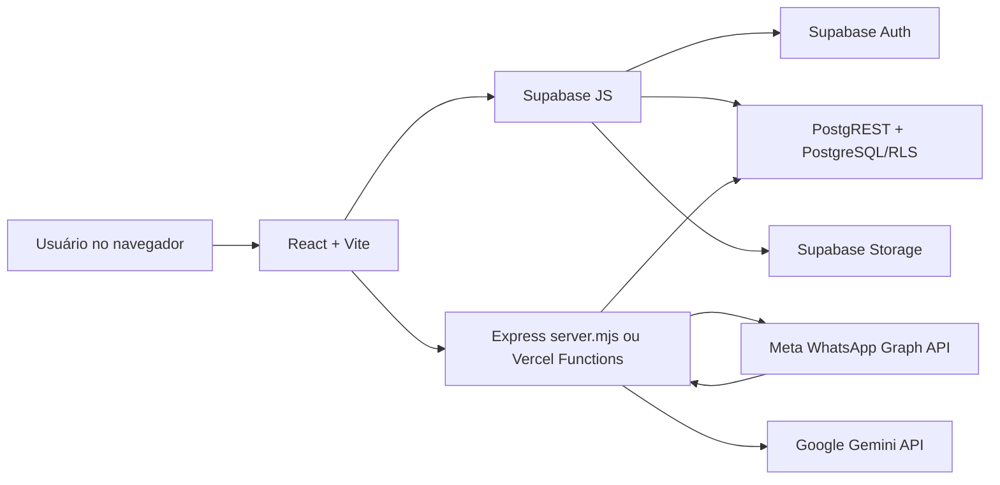

# Arquitetura Atual

## Visão geral

O Sistema Brotar é uma aplicação web para gestão escolar e multiprofissional. O frontend React acessa o Supabase diretamente para autenticação, CRUD, arquivos e regras de acesso. Backends Node/Vercel atendem às integrações com WhatsApp e Gemini; ambas recebem a sessão Supabase do usuário, enquanto credenciais privilegiadas permanecem no servidor.



Essa arquitetura torna RLS, funções RPC e políticas de Storage parte do perímetro de segurança, e não apenas detalhes de persistência.

## Estrutura observada

```text
src/
  App.tsx                 rotas, sessão e navegação
  main.tsx                bootstrap React
  features/               módulos mais recentes
  pages/, components/     páginas e UI compartilhada
components/               telas e módulos legados ainda ativos
services/
  SupabaseService.ts      gateway central de dados e autenticação
  geminiService.ts        chamada direta ao Gemini
contexts/, hooks/, utils/ suporte transversal
api/whatsapp/             funções serverless de envio e webhook
api/gemini/               proxy serverless autenticado para IA
server.mjs                Express, integrações e hospedagem de dist
db/migrations/            migrações versionadas V11–V45 e avulsas
tests/integration/        testes Vitest de RLS
public/                   ativos estáticos
dist/                     bundle gerado e atualmente versionado
```

Há duas organizações coexistindo: a estrutura moderna sob `src/` e uma estrutura histórica na raiz. Alguns domínios estão concentrados em arquivos extensos, especialmente `components/ClinicalPages.tsx` e `services/SupabaseService.ts`.

## Tecnologias e execução

- React 18, TypeScript, React Router e Vite 6 no frontend.
- Supabase JS para Auth, PostgREST, RPC e Storage.
- Vitest para testes unitários e de integração.
- Express em `server.mjs` e funções Vercel em `api/whatsapp/` e `api/gemini/`.
- Node.js 22.x declarado no projeto.
- Tailwind/utilitários e estilos locais para apresentação; jsPDF e bibliotecas auxiliares para documentos.

O desenvolvimento inicia com `npm run dev`. O build real é `npm run build:vite`; `npm run build` não produz bundle. `npm run preview` serve o resultado. `npm start` executa o servidor Express, que também pode servir `dist/`.

## Fluxos principais

### Sessão e autorização

`src/App.tsx` recupera a sessão do Supabase, carrega o perfil e mantém o usuário em estado React. `ProtectedRoute` exige apenas uma sessão carregada. Restrições por papel aparecem em componentes ou menus, mas a autorização efetiva depende das políticas RLS. Os papéis encontrados incluem `ADMIN`, coordenação, secretarias, especialistas clínicos, profissionais de apoio e funções regionais.

O tenant lógico é composto por escola, unidade e, em partes do sistema, região. A cobertura desse escopo não é uniforme entre as migrações. Dados de papel aparecem tanto em `profiles` quanto em metadata do Auth, o que cria duas fontes de verdade.

### Alunos, escolas e usuários

As telas chamam métodos de `SupabaseService`, que usam o cliente Supabase no navegador. Alunos se relacionam com escolas e armazenam vários dados estruturados em colunas JSON. A administração de usuários combina operações de Auth com a tabela `profiles` e RPCs como `delete_user_complete`, `set_user_password` e `clear_must_change_password`.

### Agenda e atendimento clínico

Agendamentos usam `appointments`; sessões usam `clinical_sessions`. O frontend registra evolução, documentos e dados por especialidade. Parte dos dados clínicos também fica agregada em `students.clinical_info`, criando sobreposição de autoridade e regras. WhatsApp pode confirmar ou cancelar agendamentos por webhook.

### Nutrição, apoio e documentos

O módulo nutricional usa tabelas de avaliação, anamnese, medidas, plano e acompanhamento. Profissionais de apoio e seus documentos usam tabelas próprias e Storage. Documentos de alunos também usam Storage e URLs retornadas pelo cliente. Atestados de comparecimento são gerados no navegador e persistidos em `attendance_certificates`.

### Relatórios, IA e integrações

Relatórios e documentos são montados principalmente no frontend. O Gemini recebe um prompt por `/api/gemini/generate`, após autenticação da sessão Supabase; modelo, persona e chave ficam no backend. O WhatsApp possui duas implementações paralelas: Express (`server.mjs`) e Vercel (`api/whatsapp/*`). ViaCEP é usado para consulta de endereço.

## Entidades e relacionamentos relevantes

- `profiles` associa o usuário Auth a papel, escopo e estado ativo.
- `schools` organiza alunos e parte do escopo institucional.
- `students` concentra cadastro, responsáveis e JSON clínico/educacional.
- `appointments` liga aluno, profissional, data e estado do atendimento.
- `clinical_sessions` liga aluno, profissional e especialidade.
- `support_professionals` representa profissionais e documentos de apoio.
- `nutrition_*` cobre o ciclo de atendimento nutricional.
- `attendance_certificates` registra atestados emitidos.
- `audit_logs`, `system_settings`, `system_messages` e `letterhead_config` dão suporte operacional.
- Buckets observados no código: `student-documents` e `students-photos`.

Nem todas as entidades usadas pelo código possuem definição canônica na cadeia de migrações. As relações acima representam o contrato inferido do frontend e dos SQLs disponíveis, não uma garantia do schema remoto.

## Limites e débitos arquiteturais

1. O navegador concentra regras de negócio e acessa o banco diretamente; qualquer regra crítica precisa existir novamente no banco ou backend.
2. A autorização está distribuída entre rotas, componentes, `profiles`, metadata e RLS.
3. Express e Vercel duplicam a integração WhatsApp e já apresentam comportamento diferente.
4. A cadeia de migrações não contém todas as tabelas/RPCs usadas, enquanto dezenas de SQLs permanecem na raiz.
5. Dados clínicos aparecem em tabelas especializadas e em JSON de `students`.
6. Não há módulo financeiro ou de caixa identificado no código auditado.

Consulte `AUDITORIA_TECNICA.md` para evidências e severidade, `MAPA_FRONTEND_BACKEND.md` para compatibilidade por fluxo e `PLANO_DE_CORRECAO.md` para a sequência recomendada.
