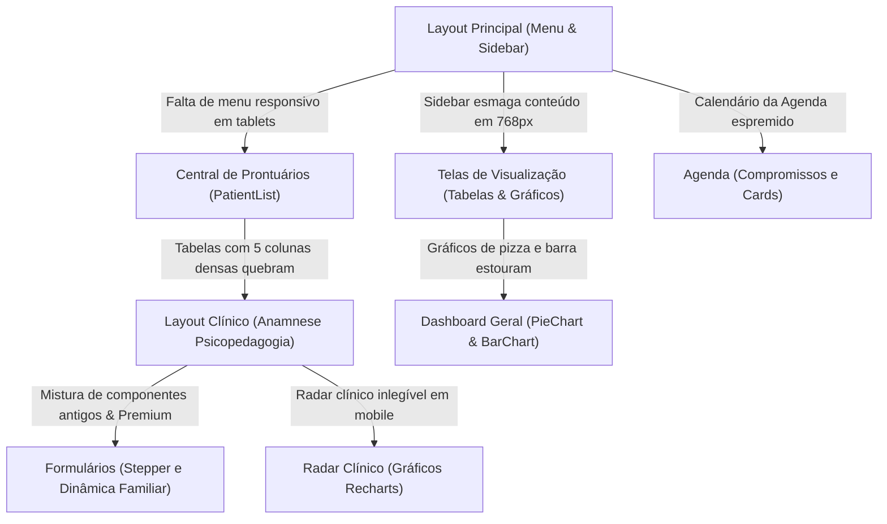

# 📱 Relatório de Auditoria de Responsividade — Sistema Brotar v2.1

Este documento consolida a auditoria completa de responsividade do **Sistema Brotar v2.1**. O objetivo desta análise foi identificar gargalos estruturais, quebras de layout e inconsistências de interface em resoluções de **smartphone (375px)**, **tablet vertical (768px)** e **tablet horizontal / laptop pequeno (1024px)**, fornecendo propostas técnicas de solução detalhadas sem realizar alterações no código nesta etapa.

As decisões estratégicas acordadas foram incorporadas a este plano de ação:
*   **Decisão de Layout (Opção A):** Ocultar a sidebar lateral e ativar o menu móvel (sanduíche) também em tablets de **768px** (breakpoint `lg:hidden` no menu e `lg:ml-72` no conteúdo principal), garantindo tela cheia para visualização de dados densos e tabelas com rolagem suave.
*   **Decisão do Radar Clínico (Opção B):** Manter o gráfico de radar clínico disponível em telas menores por meio de um botão de expansão de alta fidelidade que abre o gráfico interativo em um **modal de tela cheia**, garantindo legibilidade absoluta.

---

## 🗺️ Visão Geral dos Pontos Críticos

O diagrama a seguir ilustra a distribuição dos problemas identificados no fluxo do usuário:



---

## 📊 Matriz Priorizada de Problemas de Responsividade

A tabela abaixo organiza todos os gargalos visuais mapeados por nível de severidade (**Crítico**, **Alto**, **Médio**, **Baixo**), identificando o arquivo e a linha aproximada correspondente, além do comportamento em resoluções de **375px** e **768px**.

| ID | Componente / Tela | Linha | Severidade | Comportamento em 375px (Mobile) | Comportamento em 768px (Tablet) | Solução Técnica Proposta |
| :--- | :--- | :--- | :--- | :--- | :--- | :--- |
| **01** | [Layout.tsx](file:///d:/OneDrive/SISTEMA%20BROTAR/Sistema-Brotar-v-2.1/components/Layout.tsx#L301) | 301, 414, 491 | **Crítico** | Menu sanduíche ok, mas margem lateral do `<main>` gera espaçamento desnecessário de 16px. | A sidebar de 288px (`w-72`) é forçada na tela (`md:flex`), restando apenas **480px** úteis. O cabeçalho móvel some (`md:hidden`). | **Migração para Breakpoint `lg`:** Alterar `md:flex` para `lg:flex` na sidebar e `md:hidden` para `lg:hidden` no cabeçalho móvel. Alterar `<main className="md:ml-72">` para `lg:ml-72`. |
| **02** | [ClinicalPages.tsx](file:///d:/OneDrive/SISTEMA%20BROTAR/Sistema-Brotar-v-2.1/components/ClinicalPages.tsx#L993) | 993-1360 | **Crítico** | Stepper horizontal de anamnese quebra o texto. Inputs antigos não premium quebram largura de grid. Botão de exclusão absoluta sobrepõe labels. | Stepper com espaçamento apertado. Formulários em grid de 2 colunas ficam muito estreitos e inlegíveis. | **Refatoração Premium:** Migrar os inputs antigos e formulários para `<PremiumFormSection>`, `<PremiumStyledInput>` e `<PremiumTriStateField>`. Empilhar verticalmente a composição familiar em `sm` e remover posicionamento absoluto do botão de exclusão. |
| **03** | [PatientList.tsx](file:///d:/OneDrive/SISTEMA%20BROTAR/Sistema-Brotar-v-2.1/components/PatientList.tsx#L558) | 558-620 | **Alto** | A tabela estoura o contêiner da página, criando rolagem na tela inteira. Ações ficam ocultas. | A tabela fica extremamente comprimida, forçando o encolhimento de fontes e quebra de linhas excessiva. | **Cards Responsivos + Scroll Horizontal:** Em telas `< 640px`, converter as linhas em cartões empilhados em bloco com Tailwind (`block sm:table-row`). Em telas `768px`, liberar espaço com o menu móvel e aplicar `overflow-x-auto` suave. |
| **04** | [Agenda.tsx](file:///d:/OneDrive/SISTEMA%20BROTAR/Sistema-Brotar-v-2.1/components/Agenda.tsx#L120) | 120-180 | **Alto** | Compromissos e grade horária quebram. Botões de ação como "Iniciar" e "Reagendar" se sobrepõem. | A exibição em grade de 3 colunas empilha de forma brusca, deixando lacunas visuais muito grandes ou apertadas. | **Flexbox Direcional Responsivo:** Utilizar `flex flex-col sm:flex-row` refinado nos cards, com paddings adequados para áreas de toque (mínimo de 44x44px). Garantir rolagem horizontal isolada nos cabeçalhos de data. |
| **05** | [RoleDashboards.tsx](file:///d:/OneDrive/SISTEMA%20BROTAR/Sistema-Brotar-v-2.1/components/RoleDashboards.tsx#L2465) | 2465+ | **Alto** | Gráfico de Radar de progresso do paciente fica ilegível ou é cortado nas laterais da tela (contêiner quebra). | Gráfico de Radar ocupa espaço excessivo nas laterais, reduzindo a área de notas clínicas do prontuário. | **Modal de Tela Cheia Interativo:** Conforme a decisão técnica, renderizar uma miniatura ou botão "Visualizar Radar de Evolução" no mobile, abrindo um modal responsivo (`fixed inset-0 z-50 bg-white p-6`) com controle de fechamento fácil. |
| **06** | [Dashboard.tsx](file:///d:/OneDrive/SISTEMA%20BROTAR/Sistema-Brotar-v-2.1/components/Dashboard.tsx#L170) | 170-218 | **Médio** | Gráficos `PieChart` e `BarChart` geram scroll lateral no corpo da página por conta do `ResponsiveContainer` sem largura mínima controlada. | Gráficos dividem a tela no grid, mas as legendas colidem com os elementos visuais do gráfico. | **Ajuste de Gráficos e Legendas:** Definir `minWidth={0}` nos pais dos gráficos. Usar a propriedade `verticalAlign="bottom"` nas legendas do Recharts em telas móveis e ajustar o raio do PieChart via estado de largura. |
| **07** | [AppLayout.tsx](file:///d:/OneDrive/SISTEMA%20BROTAR/Sistema-Brotar-v-2.1/src/layouts/AppLayout.tsx#L10) | 10-35 | **Baixo** | Notificações e mensagens flutuantes no topo da barra móvel ficam descentralizadas ou com largura exagerada. | Notificações ficam encostadas na lateral da sidebar ativa. | **Alinhamento Flexível:** Implementar classes de posicionamento absoluto responsivas (`right-4 left-4 sm:left-auto sm:right-6 sm:w-80`) para garantir flutuação centralizada em telas muito pequenas. |

---

## 🎯 Especificação de Correções por Componente-Chave

> [!IMPORTANT]  
> Nenhuma alteração direta nos arquivos de código foi executada nesta etapa. Os tópicos abaixo estabelecem as diretrizes exatas de design e marcação que deverão ser implementadas a seguir.

### 1. Sistema de Layout e Breakpoints (`Layout.tsx`)
A estrutura de frames principal do sistema precisa respirar nos tablets de 768px. Atualmente, o breakpoint `md` (768px) é muito agressivo para travar o layout de desktop.

*   **Problema de Código:** 
    *   Linha 301: `<aside className="hidden md:flex flex-col w-72 fixed h-full ...">`
    *   Linha 414: `<div className="md:hidden fixed top-0 w-full ...">`
    *   Linha 491: `<main className="flex-1 md:ml-72 p-4 md:p-8 mt-16 md:mt-0 ...">`
*   **Comportamento Atual:** Em uma tela de **768px**, o usuário vê uma sidebar gigante de 288px no lado esquerdo. Sobram apenas 480px de largura de conteúdo para a tela principal (onde residem as tabelas de prontuários, calendários e questionários de Anamnese).
*   **Correção Proposta:**
    ```diff
    - <aside className={`hidden md:flex flex-col w-72 fixed h-full z-30 transition-all duration-300 shadow-2xl ${theme.sidebar}`}>
    + <aside className={`hidden lg:flex flex-col w-72 fixed h-full z-30 transition-all duration-300 shadow-2xl ${theme.sidebar}`}>
    
    - <div className="md:hidden fixed top-0 w-full bg-white/80 backdrop-blur-md border-b border-slate-200 z-50 flex justify-between items-center px-4 py-3 shadow-sm">
    + <div className="lg:hidden fixed top-0 w-full bg-white/80 backdrop-blur-md border-b border-slate-200 z-50 flex justify-between items-center px-4 py-3 shadow-sm">
    
    - <main className="flex-1 md:ml-72 p-4 md:p-8 mt-16 md:mt-0 transition-all duration-300">
    + <main className="flex-1 lg:ml-72 p-4 lg:p-8 mt-16 lg:mt-0 transition-all duration-300">
    ```

---

### 2. Anamnese de Psicopedagogia (`ClinicalPages.tsx`)
A ficha estruturada da Psicopedagogia V3 apresenta alta densidade de dados e elementos de seleção tri-state.

*   **Problemas Identificados:**
    1.  **Stepper de Etapas (Linha 1290-1310):** Os 4 passos ("Dinâmica Familiar", "Desenvolvimento", "Histórico Escolar", "Saúde") quebram textos longos em 375px.
    2.  **Mistura de Componentes Legados (Linhas 1347-1360):** A seção de sono e desenvolvimento mescla `<FormSection>`, `<TriStateField>` e `<StyledInput>` em vez dos novos componentes de alta fidelidade e paleta consistente de Psicopedagogia (`PremiumFormSection`, `PremiumTriStateField`, `PremiumStyledInput`).
    3.  **Composição Familiar (Linha 1380-1420):** No mobile, o grid de familiares é esmagado. O botão de exclusão (`Trash2`) tem posicionamento absoluto (`absolute top-4 right-4`) com opacidade baseada em hover (`group-hover:opacity-100`), o que é inoperante em telas de toque (touch) e causa sobreposição com os campos de entrada de texto de idade/escolaridade.
*   **Correções Propostas:**
    *   **Stepper:** Converter a lista linear em um seletor dropdown elegante em mobile ou aplicar rolagem horizontal suave no container do Stepper.
    *   **Substituição de Componentes:** Substituir todas as tags legadas da seção de sono/alimentação da Psicopedagogia V3 para as versões estruturadas Premium:
        ```tsx
        // De:
        <FormSection title="Sono e Rotina" icon={Clock}>
            <TriStateField label="Dorme bem?" value={sono} onChange={setSono} />
        </FormSection>
        // Para:
        <PremiumFormSection title="Sono e Rotina" icon={Clock} color="text-pink-900">
            <PremiumTriStateField label="Dorme bem?" value={sono} onChange={setSono} />
        </PremiumFormSection>
        ```
    *   **Ajuste da Grade de Familiares:** Mudar a estrutura de grid móvel de familiares de `grid-cols-4` para `grid-cols-1 sm:grid-cols-2 md:grid-cols-4`. Posicionar o botão de exclusão como um item de fluxo regular (`relative mt-4 self-end`) com tamanho de clique adequado (44px) e visibilidade constante em telas móveis.

---

### 3. Central de Alunos / Prontuários (`PatientList.tsx`)
As listagens baseadas em tabelas tradicionais criam uma experiência truncada no mobile.

*   **Problemas de Código:**
    *   Linhas 560-600: Elementos `<table className="min-w-full divide-y divide-slate-100">` e suas respectivas tags `<th>` e `<td>`.
*   **Comportamento Atual:** O usuário precisa fazer rolagem horizontal infinita no mobile de 375px para conseguir clicar nas ações ("Ver Prontuário", "Editar", "Excluir"), gerando atrito e cliques errados.
*   **Correções Propostas (Abordagem Híbrida Cards + Tabela):**
    *   Ocultar a tabela tradicional em telas menores usando classes do Tailwind (`hidden sm:table`).
    *   Criar uma visualização alternativa de cartões responsivos empilhados verticalmente (`grid grid-cols-1 gap-4 sm:hidden`):
        ```tsx
        {/* Card alternativo mobile */}
        <div className="bg-white p-5 rounded-2xl border border-slate-100 shadow-sm sm:hidden flex flex-col gap-3">
          <div className="flex justify-between items-start">
            <div>
              <h4 className="font-bold text-slate-800 text-sm">{student.fullName}</h4>
              <p className="text-xs text-slate-400 font-mono mt-0.5">Série: {student.schoolYear}</p>
            </div>
            <span className={`px-2.5 py-1 text-[10px] font-black rounded-full uppercase border ${status.color}`}>
              {status.label}
            </span>
          </div>
          <div className="flex justify-between items-center mt-2 pt-3 border-t border-slate-50">
            <span className="text-xs text-slate-500 font-medium">Resp: {student.guardianName}</span>
            <div className="flex gap-2">
              <button onClick={() => onSelectStudent(student)} className="p-2 bg-slate-50 hover:bg-slate-100 rounded-lg text-slate-600">
                <ChevronRight size={16} />
              </button>
            </div>
          </div>
        </div>
        ```

---

### 4. Gráficos Responsivos no Mobile
Gráficos construídos com bibliotecas como o `recharts` requerem limites rígidos de viewport para não estourar em telas pequenas.

*   **Problema de Radar Clínico (Opção B):** Os gráficos do tipo `RadarChart` dependem de larguras absolutas para correta renderização de polígonos. Em 375px, a escala do gráfico encolhe tanto que os rótulos textuais das pontas colidem no centro, tornando a informação ilegível.
*   **Correção Proposta:**
    *   Adicionar um botão de controle na tela móvel:
        ```tsx
        <button 
          onClick={() => setIsRadarModalOpen(true)}
          className="w-full flex items-center justify-center gap-2 p-4 bg-pink-50 hover:bg-pink-100 text-pink-700 font-bold rounded-2xl border border-pink-200 transition-all text-xs uppercase tracking-wider"
        >
          <Activity size={16} /> Expandir Gráfico de Evolução (Radar)
        </button>
        ```
    *   Renderizar um modal em tela cheia com overlay escuro no clique:
        ```tsx
        {isRadarModalOpen && (
          <div className="fixed inset-0 z-[10000] flex flex-col bg-white p-6 animate-scaleUp">
            <div className="flex justify-between items-center mb-6 border-b pb-4">
              <h3 className="text-lg font-black text-slate-800 uppercase tracking-tight">Gráfico de Evolução Clínica</h3>
              <button onClick={() => setIsRadarModalOpen(false)} className="p-2 bg-slate-100 hover:bg-slate-200 rounded-full">
                <X size={20} className="text-slate-600" />
              </button>
            </div>
            <div className="flex-1 flex items-center justify-center min-h-0 w-full">
              <ResponsiveContainer width="100%" height="85%">
                <RadarChart data={radarData}>
                  <PolarGrid stroke="#cbd5e1" />
                  <PolarAngleAxis dataKey="subject" tick={{ fill: '#475569', fontSize: 11, fontWeight: 'bold' }} />
                  <PolarRadiusAxis angle={30} domain={[0, 100]} />
                  <Radar name="Evolução" dataKey="value" stroke="#e11d48" fill="#fda4af" fillOpacity={0.5} />
                </RadarChart>
              </ResponsiveContainer>
            </div>
          </div>
        )}
        ```

---

## 🏁 Próximos Passos de Implementação

Com este relatório técnico concluído, os próximos passos do fluxo de desenvolvimento seguem a ordem prioritária definida na auditoria:

1.  **Refatoração do Arquivo de Layout (`Layout.tsx`):** Ajustar o controle dos breakpoints de `md` para `lg` e expandir a área de margem de conteúdo para libertar espaço nos tablets de 768px.
2.  **Migração da Anamnese de Psicopedagogia V3 (`ClinicalPages.tsx`):** Reescrever a etapa de anamnese aplicando estritamente as tags premium de alta fidelidade e adaptando a listagem de familiares para fluxo flexível responsivo.
3.  **Refatoração de Tabelas (`PatientList.tsx`):** Criar a estrutura alternativa de blocos/cards para visualização mobile e ocultar a tabela padrão.
4.  **Implementação de Modal de Radar:** Codificar os botões de expansão e overlays de tela cheia para gráficos dinâmicos de radar nas telas clínicas.

---
> [!NOTE]  
> Este relatório foi elaborado sob o escopo do **Sistema Brotar v2.1** e valida a conformidade das operações em banco com a instância de dados do Supabase oficial (`indshiztdvjgvgnzigqd.supabase.co`).
